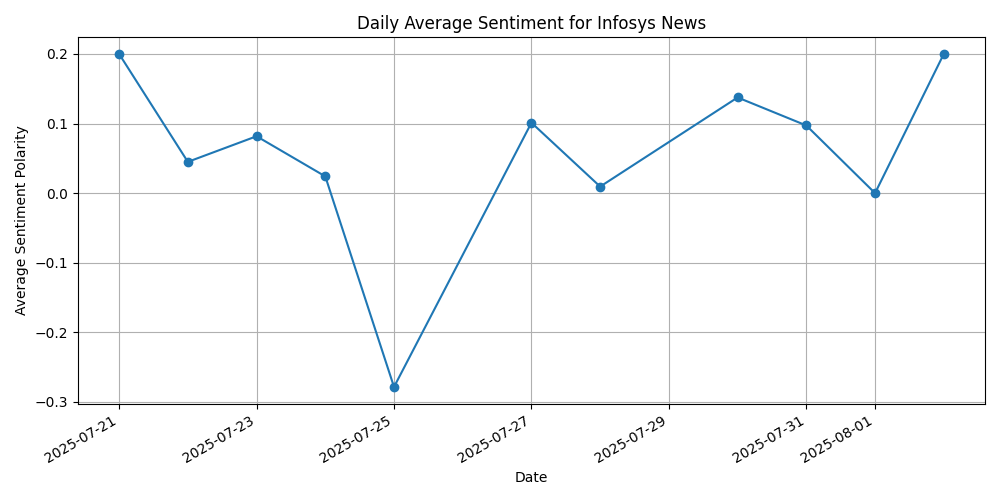

# 📈 Stock Sentiment Analysis Using News Headlines

This project performs sentiment analysis on the latest financial news headlines for a selected stock (e.g., Infosys) and visualizes sentiment trends over time.

---

## 🧠 Objective

To analyze the sentiment behind news articles related to a stock and determine how public perception may influence market movements.

---

## 📦 Project Structure

```
stock-sentiment-project/
│
├── data/
│   ├── news_data.csv               # Raw and cleaned news headlines
│   └── news_infosys.csv           # Optional filtered headlines
│
├── etl/
│   ├── news_scraper.py            # Pulls news articles using RSS
│   ├── get_stock_data.py          # [Optional] Gets historical stock prices
│   └── analyze_sentiment.py      # Performs sentiment analysis & plotting
│
├── images/
│   └── Figure_1.png               # Output sentiment trend graph
│
├── requirements.txt               # Python dependencies
└── README.md                      # Project documentation
```

---

## 🔧 How It Works

1. **Scraping**: `news_scraper.py` scrapes latest news headlines via RSS feeds.
2. **Sentiment Analysis**: `analyze_sentiment.py` uses NLP tools (TextBlob/VADER) to compute sentiment polarity.
3. **Visualization**: The sentiment scores are plotted to visualize public mood over time.
4. **[Optional] Stock Comparison**: `get_stock_data.py` can fetch real stock data for further analysis.

---

## 🛠 Setup Instructions

### 1. Clone the Repository
```bash
git clone https://github.com/sona236/stock-sentiment-analysis.git
cd stock-sentiment-analysis
```

### 2. Set Up a Virtual Environment
```bash
python -m venv venv
venv\Scripts\activate      # On Windows
# source venv/bin/activate  # On macOS/Linux
```

### 3. Install Required Packages
```bash
pip install -r requirements.txt
```

### 4. Run the Scraper
```bash
python etl/news_scraper.py
```

### 5. Run Sentiment Analyzer
```bash
python etl/analyze_sentiment.py
```

---

## 📊 Sample Output



---

## 📌 Tools & Libraries Used

- Python
- Feedparser (for RSS scraping)
- TextBlob / VADER (for sentiment analysis)
- Matplotlib (for visualization)
- Pandas

---

## 📁 Dataset

News data is stored in:
- `data/news_data.csv`: All scraped headlines
- `data/news_infosys.csv`: [Optional] Filtered by stock name

---

## ✅ Applications

- Quantitative finance research
- Social media/news impact tracking
- Market sentiment analysis

---

## 👩‍💻 Author

**Sonanithyasri**  
Email: `sonanithyasri23@gmail.com`  
GitHub: [github.com/sona236](https://github.com/sona236)

---

## 📃 License

This project is open-source and free to use for academic and personal projects.
